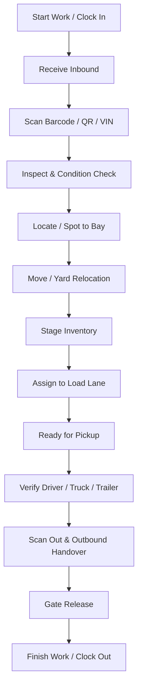

# HERO Logistics — Yard Attendant Portal Source of Truth

**Document Version:** 1.0.0  
**Last Updated:** 2026-08-15  
**Role:** `YARD` (`YARD ATTENDANT`)  
**Portal Base Route:** `/yard`  
**Tenant Scoping:** Enforced via `req.tenantId` and branch association.

---

## 1. Locked Yard Operational Flow

The Yard Attendant executes the tactical on-ground flow:

### Portal Boundaries
- **Yard Attendant:** Tactical execution (move, spot, stage, inspect, gate release, issue reporting).
- **Warehouse Manager:** Supervisory configuration (holding areas, lane capacity, threshold settings).
- **Dispatcher:** Tactical planning (load assignments, schedules, linehaul coordination).
- **Driver:** Road transit execution (pickup verification, dispatch, delivery, POD).

---

## 2. Menu Structure & Component Mapping

| # | Sidebar Label | Route Path | Component File | Operational Purpose |
|---|---|---|---|---|
| 1 | **Start Work / Finish Work** | `/yard/work-status` | `YardWorkStatus.jsx` | Shift clock in/out, telemetry tracking, break status. |
| 2 | **Dashboard** | `/yard/dashboard` | `YardDashboard.jsx` | Live yard occupancy, inbound deliveries, pending moves. |
| 3 | **Receive (Inbound Intake)** | `/yard/inbound` | `WarehouseInbound.jsx` | 5-step receiving intake flow, VIN/rego verification. |
| 4 | **Find & Search** | `/yard/current-stock` | `WarehouseCurrentStock.jsx` | Multi-field lookups by VIN, rego, SKU, and slot location. |
| 5 | **Move** | `/yard/movements` | `YardMoveItem.jsx` | Live item selection, spot/lane relocation, atomic DB move. |
| 6 | **Stage Inventory** | `/yard/holding-areas` | `WarehouseHoldingAreas.jsx` | View staging capacity and staged item lists. |
| 7 | **Load Lanes** | `/yard/load-lanes` | `WarehouseLoadLanes.jsx` | Staging lanes 1–8, load assignments, and prep progress. |
| 8 | **Vehicles** | `/yard/vehicles` | `Vehicles.jsx` | Operational lookup of assigned depot fleet. |
| 9 | **Locations** | `/yard/locations` | `YardLocations.jsx` | Live depot zones, bays, lanes, and staging occupancy. |
| 10 | **Loads** | `/yard/loads` | `Loads.jsx` | Yard-relevant loads (Inbound, Staging, Ready for pickup). |
| 11 | **Activities** | `/yard/activities` | `WarehouseReports.jsx` | Immutable audit ledger of item movements. |
| 12 | **QR / Barcode Scan** | `/yard/scanning` | `WarehouseScanning.jsx` | Asset tag verification and scanner input. |
| 13 | **Yard & Warehouse Map** | `/yard/map` | `WarehouseMap.jsx` | Visual interactive depot grid map. |
| 14 | **Outbound Handover** | `/yard/outbound` | `WarehouseOutbound.jsx` | Gate-out driver verification and load handover. |
| 15 | **Labels & Barcodes** | `/yard/labels` | `WarehouseLabels.jsx` | Barcode/label printing and spooler status. |
| 16 | **Reports & Analytics** | `/yard/reports` | `WarehouseReports.jsx` | Scoped yard execution metrics and activity history. |
| 17 | **Report Issue** | `/yard/report-issue` | `YardReportIssue.jsx` | Safety checks, trailer damages, and defect holds. |

---

## 3. Backend API Endpoints (`/api/warehouse-portal/*`)

All endpoints are authenticated with `verifyToken` and scoped via `resolveTenant`:

- `GET /warehouse-portal/dashboard` — Live metrics (overview, inYard, capacity, deliveries).
- `GET /warehouse-portal/stock` — Scoped inventory items with canonical location details.
- `POST /warehouse-portal/stock/move` — Atomic location update + item movement logging.
- `GET /warehouse-portal/load-lanes` — Load lanes with associated loads and staged items.
- `GET /warehouse-portal/holding-areas` — Staging area capacity and occupancy.
- `GET /warehouse-portal/inbound/receipts` — Inbound receipt history.
- `POST /warehouse-portal/inbound/receive` — Multi-item receipt intake with audit logging.
- `GET /warehouse-portal/issues` — Live reported safety issues and defect logs.
- `POST /warehouse-portal/report-issue` — Logs issue, puts High-severity items on `HOLD`.
- `DELETE /warehouse-portal/issues/:id` — Resolves/archives reported issues.

---

## 4. Key Implementation Changes Completed

1. **Sidebar Navigation:**
   - Renamed `Load Lane Management` → `Load Lanes`.
   - Renamed `Outbound Dispatch` → `Outbound Handover`.
   - Dynamic user role resolution for `YARD` (`YARD ATTENDANT`).
   - Strict menu preservation: No menus added, no menus removed.

2. **Route Corrections in `App.jsx`:**
   - `/yard/dashboard` mapped to dedicated `YardDashboard.jsx`.
   - `/yard/movements` and `/yard/move` mapped to `YardMoveItem.jsx` (active move form).
   - `/yard/locations` mapped to `YardLocations.jsx` (replacing the improper Company Admin `Branches` admin view).

3. **Live API Integrations:**
   - `YardMoveItem.jsx`: Connects to `/warehouse-portal/stock` and `/warehouse-portal/stock/move`.
   - `YardLocations.jsx`: Live zone, bay, load lane, and holding area rendering.
   - `YardReportIssue.jsx`: Connects to `/warehouse-portal/report-issue` and `/warehouse-portal/issues`.
   - `YardDashboard.jsx`: Live KPI stats for In Yard, Inbound, and Capacity %.
